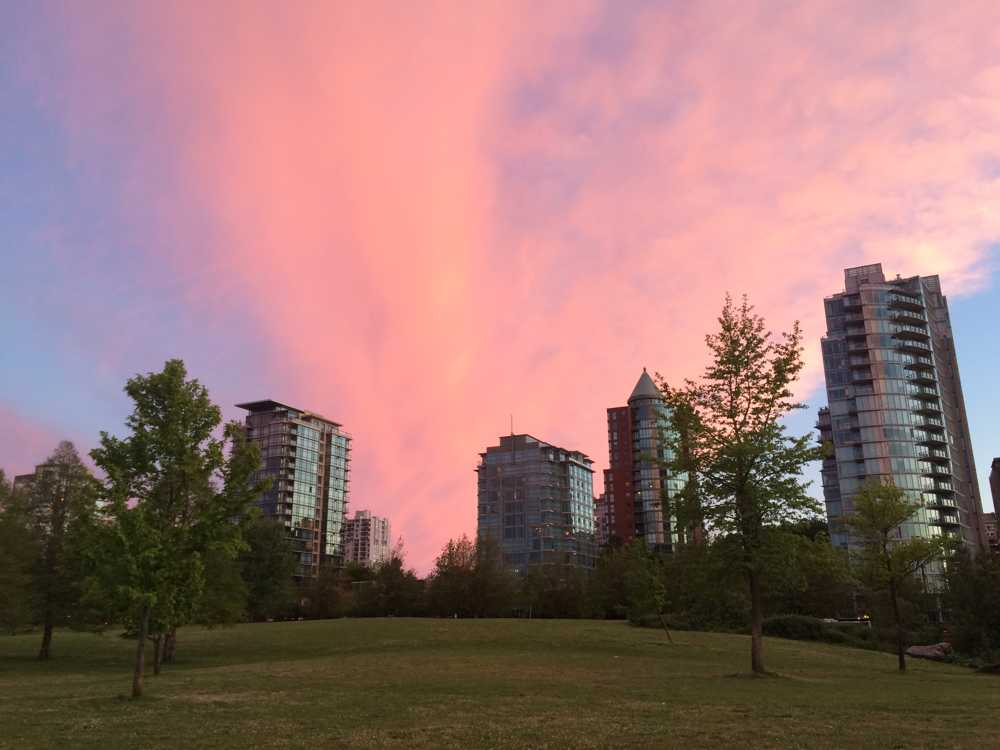
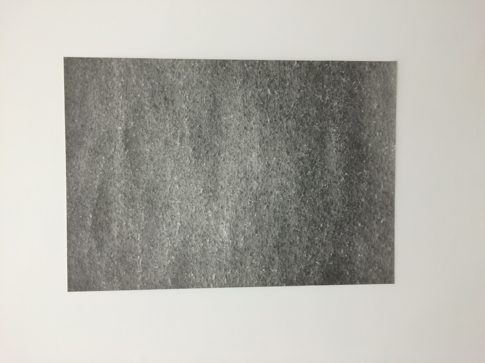

## Vancouver

I spent a couple days in Vancouver with Jackie, who I first met in Peterborough coincidentally and Ankit. Checked out Stanley Park on bike with Jackie on the first day. It's so pretty here!

Then I went roaming around town the next day and went to the Contemporary Art Gallery

## Day 1
Got on a ferry to Swartz Bay. Here’s a view from the ferry to Vancouver Island.
Took a bus to the prairie inn bar and waited for Rachel to come pick me up since my phone stopped working and I was too tired to walk for 50 minutes. Made conversation with the bartender in the meantime and she asked me to check out buzz Victoria for the latest events etc. Rachel picks me up, takes me to the farm and introduced me to her partner Grant and kids Elias and Jade, who were playing Magic the gathering with a bunch of friends. 

I offered to jump right into the farm and off we went to the farm. Met Lauren, the current farm apprentice, who was working on thinning the seed bed for a crop. The bed was seeded using a machine and the crops were too dense to allow for healthy growth. Lauren had tons of tattoos and seemed like a badass. She cares a lot about native people and invests a lot of her time and effort into fighting for causes that matter to her but was getting disappointed since none of these causes were having impact in a noticeable manner. I was kinda hungry by then so Lauren showed me her outdoor kitchen and gave me a few ingredients so I could throw myself a salad. 

Also got to meet Stacy, who also had tons of tattoos, and is an employee of the farm. She was watering some plants and showed me how to do it and got me to continue watering the plants still not planted in crop beds. Plant watering is so Zen I really like it. 

Once it was last 5, we stopped working and decided to go exploring the trails nearby. We went down a trail that explicitly said it wasn't safe. It was so cool and lead us through a forest to a clearing to the sea inlet near their house. Lauren proceeded to collect oysters while I just stood there since I can't swim and the water was really cold. We had some interesting talks about indigenous peoples and their history and the injustices meted out to them and how to deal with the guilt caused by our ancestors injustices. 

I then had dinner with Rachel’s family, who are all super interesting. I think it was a great first day and I look forward to learning and writing more
